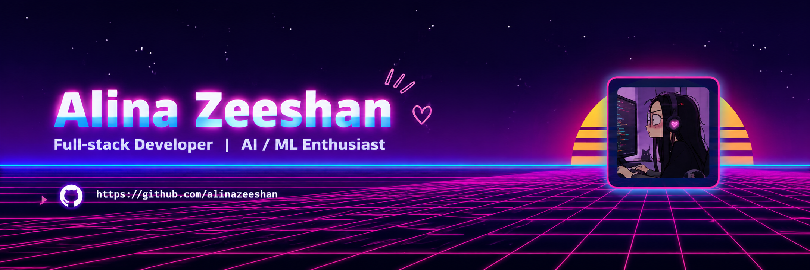

  

<h1 align="center">
  Hey there, I'm Alina Zeeshan 👋
</h1>

  

  
  
  

---

## 👩‍💻 About Me

* 💻 Full-Stack Developer building with the **MERN stack**
* 🤖 Exploring **AI / Machine Learning**, LangChain and multi-agent systems
* 🚀 Building AI-powered projects and contributing to Open Source
* 🎯 Creating products that solve real-world problems
* ✨ Turning ideas into reality, one commit at a time

---

## 💻 Tech Stack

  

---

## 📊 GitHub Analytics

  

---

## 🔥 GitHub Streak

  

---

## 📈 Contribution Activity

  

---

## 🐍 Purple Contribution Snake

  <picture>
    <source
      media="(prefers-color-scheme: dark)"
      srcset="https://raw.githubusercontent.com/alinazeeshan/alinazeeshan/output/github-snake-dark.svg"
    />
    <source
      media="(prefers-color-scheme: light)"
      srcset="https://raw.githubusercontent.com/alinazeeshan/alinazeeshan/output/github-snake.svg"
    />
    
  </picture>

---

## 📌 Pinned Projects

  ✨ Check out my pinned repositories!

---

## 🌐 Let's Connect

  

  <b>💜 See you in the next commit!</b>

  

